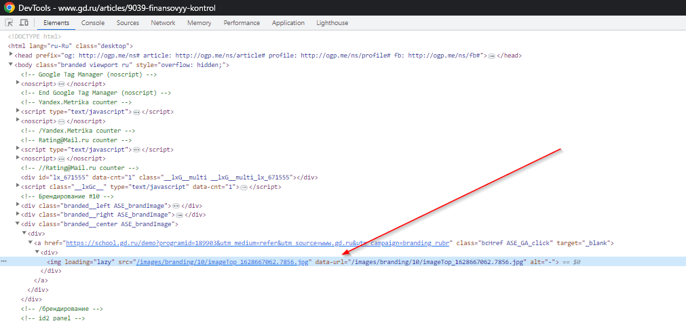
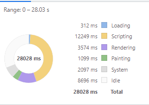
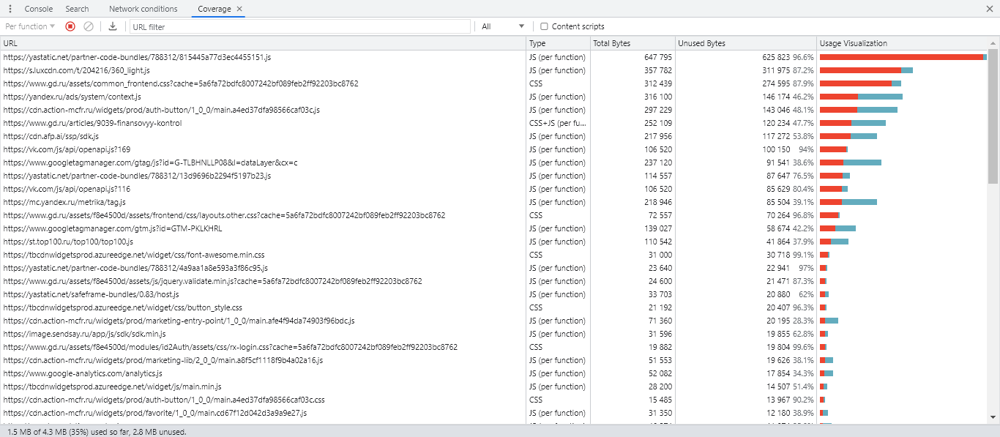
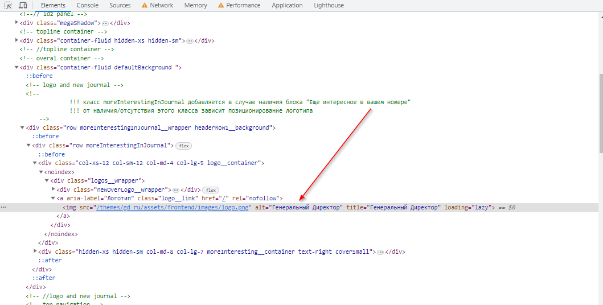
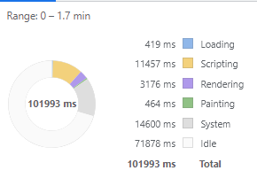


# Использование Chrome DevTools - анализ открытия сайта.

## 1 Network

### 1.1 профиль загрузки ресурсов при открытии страницы - [www.gd.ru.har](./network/www.gd.ru.har)

### 1.2 Неоптимальные места

#### 1.2.1 дублирование ресурсов

- popper.min.js
  
- openapi.js
  
- jquery-3.5.1.js
  
- code.js
  
- bootstrap.min.js, bootstrap.min.css, bootstrap.bundle.min.js
  
- fontawesome-webfont.woff2?v=4.7.0
  
- system_gd-logo.png
  
- data:image/png;base64...
  

#### 1.2.2 Лишний размер ресурса

- Первый загружаемый файл 9039-finansovyy-kontrol имеет много инлайновых скриптов и стирей (js и css непосредственно написанные в тегах script и style). Если посмотреть на документ в coverage. То можно увидеть, что после разгузки используется только 60% из всего документа. Вынос неиспользованных js и css в отдельные файлы и дозагрука позволит уменьшить размер первого загружаемого файла, а то есть время до первого взаимодействия со страницей + дать браузеру решать как более эффективно загрузить данные ресурсы. (браузер очень хитро умеет решать какие файлы нужно загрузить заранее, а какие можно отложить на потом)
  
  

- Второй загружаемый файл context.js имеет большой вес 316кб (91.6кб gzip) и подключён в теге head. А то есть пока весь файл не загрузится страница не отрендерится. Подобные большие файлы принято подключать в конце body, таким образом страница успеет сначал отрендериться, а потом загрузить необходимые скрипты. Файл получается от стороннего сервиса, так что врядли можно напрямую сократить его вес напрямую. Но скорее всего можно отложить загрузку такого большого файла установкой свойства
  

- common_frontend.css - Имеет большой размер 86% которого не используетс при первой загрузке. Можно вынести неиспользуемые стили в другой файл и загружать их позже
  
  
- base.js так же имеет большой размер и находится в теге head, что опять же блокирует первую отрисовку страницы
  
- Так же всё описанное выше относится и ко всем файлам представленным на скриншоте ниже
  

#### 1.2.3 медленно загружающиеся ресурсы

На странице присутствует большое количество медленно загружающихся файлов. Описание отдельно каждого из них будет слишком грамоздко, так что они представлены скриншотами. (выборка от 500ms)

#### 1.2.4 ресурсы, блокирующие загрузку

На странице присутствует большое количество ресурсов блокирующих загрузку страницы. Дабы не описывать каждый отдельно они представлены скриншотами. Данные ресурсы можно разделить на несколько групп.

- Файлы стилей (.css), которые загружаются тегами link находящимися в теге head. Они блокируют рендер. Ни в одном из тегов link не использованы медиа-запросы (например media="print"), которые говорят браузеру какого рода стили находятся в каждом файле и дают ему принять решение, какие из этих файлов можно загрузить мозже не блокирую рендер страници и загрузку остальных файлов (по умолчанию файлы стилей имеют высокий приоритет загрузки)
- Скрипты (.js), которые загружаются тегами script находящимися в теге head. Расположение скриптов в теге head даёт им высокий приоритет загрузки из-за чего происходит блокировка рендера страницы и загрузки других более необходимых файлов (например шрифтов). Большинство скриптовых файлов можно переместить в конец тега body, выделить из них неиспользуюмый код в другие файлы, либо использовать другие способы, говорящие браузеру, что данные скрипты можно загрузить позже.
- Большое количество медиафайлов, которые не используются в видимой части страницы. Загрузку таких ресурсов можно отложить, чтобы дать возможность пользователю раньше взаимодействовать со транице
  
  
  
  

#### 1.2.5 что-то ещё

- Запросы со статусом 302
  
- CORS Error
  
  
- Маленькие jpeg картинки. В данном случае использование jpeg не даёт приемуществ. Стоит заменить их на png, либо на более современные webp или avif (у avif ещё плохая поддержка, но он предоставляет лучшее сжатие)
  /
- Кнопки, которые можно было сделать с помощью нескольких строк css загружаются как отдельный изображения
  

## 2 Performance

### 2.1 профиль загрузки страницы [Trace.json](https://disk.yandex.ru/d/vRtf-ACKATnfdg)

### 2.2 время в миллисекундах от начала навигации до событий

- First Paint (FP) - 2256.1 ms
- First Contentful Paint (FCP) - 2256.1 ms
- DOM Content Loaded (DCL) - 7850.0 ms
- Largest Contentful Paint (LCP) - 9759.3 ms
- Load - 27998.8 ms

### 2.3 DOM-элемент на котором происходит LCP

``

### 2.4 Время на этапы обработки документа

Учитывается время от начала загрузки страницы до события Load

- Loading - 312 ms
- Scripting - 12249 ms
- Rendering - 3574 ms
- Painting - 1099 ms

## 3 Coverage

### 3.1 Cкриншот вкладки после загрузки страницы

### 3.2 Объём неиспользованного CSS в ходе загрузки страницы

- Unused CSS 566kB

### 3.3 Объём неиспользованного JS в ходе загрузки страницы

- Unused JS 2.3MB

# Анализ при замедлении CPU 4x slowdown и эмуляции сети Slow 3G

## 1 Network

### 1.1 профиль загрузки ресурсов при открытии страницы - [www.gd.ru-slow.har](./network/www.gd.ru-slow.har)

### 1.2 Неоптимальные места

- Всё тоже самое, что и при первом тесте, только дольше.

## 2 Performance

### 2.1 профиль загрузки страницы [Trace-slow.json](https://disk.yandex.ru/d/54g3FV25XAmUbg)

### 2.2 время в миллисекундах от начала навигации до событий

- First Paint (FP) - 19856.0 ms
- First Contentful Paint (FCP) - 19856.0 ms
- DOM Content Loaded (DCL) - 51320.3 ms
- Largest Contentful Paint (LCP) - 78391.0 ms
- Load - 101955.5 ms

### 2.3 DOM-элемент на котором происходит LCP

``

### 2.4 Время на этапы обработки документа

Учитывается время от начала загрузки страницы до события Load

- Loading - 419 ms
- Scripting - 11457 ms
- Rendering - 3176 ms
- Painting - 464 ms

## 3 Coverage

- Показал теже самые данные, что и первый тест
